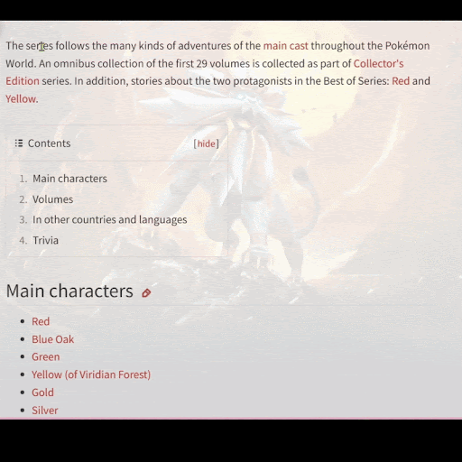

[English description here](README.md) (英語版はこちら)

# 📚 Readoku

<p align="center">
  
</p>

<p align="center">
  
  
  
  
</p>

Readokuは、Gemini APIを活用した英語から日本語へのシームレスな翻訳を提供するブラウザ拡張機能です。学生、専門家、語学学習者がブラウザ内で作業の流れを中断することなく、即座にコンテキストを考慮した翻訳を必要とする場合の言語障壁を解消するために作成されました。

## ✨ 機能

### 🔍 詳細な単語検索（Shift + ホバー）

<p align="center">
  
</p>

- `Shift`キーを押しながら英単語にホバー
- 読み方、定義、例文などの詳細情報を取得
- Gemini AIによる正確な翻訳

### 🌐 フレーズ/文章翻訳（ハイライトしてクリック）

<p align="center">
  
</p>

- テキストをハイライトしてReadokuボタン（R⚡）をクリック
- ハイライトされたテキストを日本語に即時翻訳

### 🧩 その他の機能
- **Gemini API搭載**：ニュアンスを捉えた翻訳
- **ローカル辞書のフォールバック**：API利用不可時に対応
- **安全なAPIキー処理**：環境変数による管理
- **簡単な有効/無効切り替え**：ブラウザツールバーから操作可能

## 🖥️ システム構成

Readokuはシンプルながら効果的な2つの部分から構成されています：

- **ブラウザ拡張機能（フロントエンド）**：HTML、CSS、JavaScriptで構築されたユーザー向けコンポーネント。ユーザーの操作（ホバー、ハイライト）を捕捉し、UIを表示し、リクエストを送信します。
- **プロキシサーバー（バックエンド）**：Gemini APIキーを安全に管理する軽量なPython Flaskサーバー。ブラウザ拡張機能からリクエストを受け取り、Gemini APIに転送し、翻訳結果を返します。これによりクライアント側のコードにAPIキーを露出させないようにしています。

<p align="center">
  
</p>

## 🚀 クイックセットアップ

### 1. プロキシサーバーのセットアップ

プロキシサーバーはGemini APIとの安全な通信を処理します。

```bash
# サーバーディレクトリに移動
cd proxy-server

# 仮想環境の作成と有効化
python3 -m venv .venv
source .venv/bin/activate  # Windowsの場合: .venv\Scripts\activate

# 依存関係のインストール
pip3 install -r requirements.txt
```

**APIキーの設定：**

proxy-serverディレクトリに`.env`ファイルを作成し、APIキーを追加します：
```
GEMINI_API_KEY="あなたのAPIキーをここに"
```

サーバーは自動的にこのキーを読み込みます。これはシェルにエクスポートするよりも安全です。

サーバーの実行：
```bash
python3 server.py
```

サーバーは http://localhost:5001 で起動します。

### 2. ブラウザ拡張機能のインストール

- **Chrome/Edge**：`chrome://extensions`から開発者モードを有効にし、`extension`ディレクトリを「パッケージ化されていない拡張機能を読み込む」で選択
- **Firefox**：`about:debugging`から`extension/manifest.json`ファイルを「一時的なアドオンを読み込む」で選択

## ✅ 使い方

拡張機能がインストールされ、サーバーが実行されている場合：

- **詳細な単語検索**：ウェブページ上の英単語に`Shift`キーを押しながらホバーすると、詳細な定義がポップアップで表示されます。
- **文章翻訳**：フレーズや文章をハイライトし、近くに表示されるReadoku（R⚡）ボタンをクリックします。

## 💡 コントリビューション

コントリビューションを歓迎します！アプリのアーキテクチャと実装の詳細については、[appcore.md](appcore.md)をご覧ください。

1. リポジトリをフォーク
2. 機能ブランチを作成 (`git checkout -b feature/amazing-feature`)
3. 変更をコミット (`git commit -m 'Add some amazing feature'`)
4. ブランチにプッシュ (`git push origin feature/amazing-feature`)
5. プルリクエストを開く

## 📄 ライセンス

このプロジェクトはMITライセンスの下で公開されています - 詳細は[LICENSE](LICENSE)ファイルをご覧ください。

## 📩 連絡先

Naimi Nafis: [Github](https://github.com/NaimiNafis) | [Portfolio](https://naiminafis.github.io/portfolio/)

Alvin Sebastian Lienardi: [Github](https://github.com/alvinlienardi) | [Portfolio](https://alvinlienardi.github.io/portfolio/)

Duong Nam Phong: [Github](https://github.com/duongnphong) | [Portfolio](https://duongnphong.github.io/)