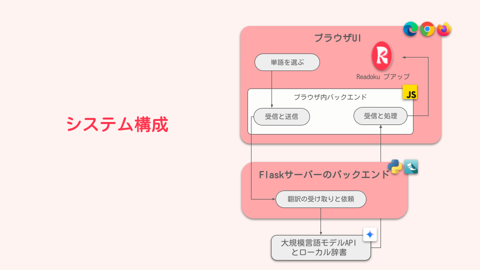

# Readoku - Technical Architecture & Implementation

## 🏗️ System Architecture Overview

Readoku is built with a client-server architecture consisting of two main components:

1. **Browser Extension**: Frontend component that runs in the user's browser
2. **Proxy Server**: Backend service that communicates with the Gemini API

<p align="center">
  
</p>

## 🧩 Components & Modules

### Browser Extension Components

The extension is structured following Chrome/Firefox extension standards with these key files:

- **manifest.json**: Extension configuration and permissions
- **content.js**: Core script injected into web pages for word detection and UI interaction
- **background.js**: Background service worker for extension state management
- **dictionary.json**: Local fallback dictionary for offline lookups

#### UI Components
- **translation-popup/**: HTML/CSS for translation results display
- **menu-popup/**: Extension popup menu for user settings
- **settings/**: Extension settings page
- **search/**: Search interface for manual lookups

### Proxy Server Components

- **server.py**: Flask-based API endpoint handling translation requests
- **gemini.js**: Utility module for Gemini API communication
- **requirements.txt**: Python dependencies

## 🔄 Data Flow & Process

### Word Lookup Flow

1. User holds Shift key + hovers over a word
2. `content.js` detects the word under cursor using DOM text node traversal
3. Word is sent to the proxy server or checked against local dictionary
4. Proxy server queries the Gemini API with a structured prompt
5. Translation data returns as JSON and displays in the popup

### Phrase Translation Flow

1. User selects text and the extension shows a translation button
2. When clicked, selected text is sent to the proxy server
3. Server queries Gemini API with phrase translation prompt
4. Translation displays in a popup overlay

## 💾 Data Management

### Local Storage
- User preferences stored in Chrome/Firefox's `storage.local` API
- Extension state (enabled/disabled) persisted between sessions
- LRU cache implemented in proxy server for frequent translations

### API Communication
- RESTful API between extension and proxy server
- Structured JSON format for exchanging translation data
- Error handling for API failures with graceful degradation

## 🔒 Security Considerations

- API key stored as environment variable in proxy server, never in client code
- Restricted API key access to only Gemini translation services
- Content validation to prevent injection attacks
- No user data stored persistently beyond session caching

## 🛠️ Technical Implementation Details

### Word Detection Algorithm

The word detection algorithm uses DOM traversal to:
1. Find text nodes under the cursor position
2. Determine word boundaries based on Unicode character properties
3. Extract the word at the current position

```javascript
// Simplified example from content.js
function findWordBoundariesInTextNode(textNode, offset) {
    const text = textNode.textContent;
    const wordCharRegex = /[\p{L}\p{N}_-]/u;
    
    // Find beginning of word
    let start = offset;
    while (start > 0 && wordCharRegex.test(text[start - 1])) {
        start--;
    }
    
    // Find end of word
    let end = offset;
    while (end < text.length && wordCharRegex.test(text[end])) {
        end++;
    }
    
    return { start, end, word: text.substring(start, end) };
}
```

### Translation Processing

The proxy server constructs specific prompts for Gemini API based on translation mode:

1. **Word Mode**: Requests detailed dictionary entry with readings, parts of speech, etc.
2. **Phrase Mode**: Requests direct translation with minimal explanation
3. **Dictionary Lookup**: Fallback mode using local dictionary when API is unavailable

### UI Rendering

The extension dynamically creates UI elements for:
- Translation popup with loading states
- Selection action button
- Settings interface

These elements are positioned based on cursor/selection location with viewport boundary adjustments.

## 🧪 Testing Strategy

- **Unit Tests**: Component-level testing for core functions
- **Integration Tests**: End-to-end translation flow testing
- **Browser Compatibility**: Tested across Chrome, Firefox, and Edge

## 🔧 Extension Configuration

The `manifest.json` defines key extension properties:

```json
{
  "manifest_version": 3,
  "permissions": ["activeTab", "scripting", "storage"],
  "content_scripts": [{
    "matches": ["<all_urls>"],
    "js": ["content.js"],
    "css": ["translation-popup/translation-popup.css"]
  }],
  "action": {
    "default_popup": "menu-popup/popup.html"
  }
}
```
## 📦 Deployment Considerations

### Browser Extension
- Manual loading in developer mode
- Future: Potential publishing to Chrome/Firefox extension stores

### Proxy Server
- Currently runs locally on user's machine
- Could be deployed as a cloud service with proper API key management
- Docker containerization possible for easier deployment

## 🚀 Future Development Roadmap

1. **Enhanced Dictionary**: Expanded local dictionary for better offline support
2. **Custom Styling**: Additional UI customization options
3. **Learning Features**: Vocabulary tracking and spaced repetition
4. **Context-Aware Translation**: Improved translation based on surrounding text
5. **Multi-Language Support**: Expand beyond Japanese to other languages 
